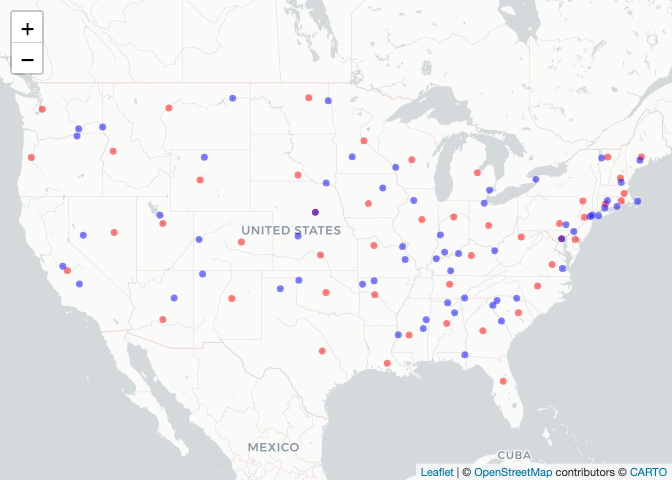

Lab 05 - Data Wrangling
================

# Learning goals

- Use the `merge()` function to join two datasets.
- Deal with missings and impute data.
- Identify relevant observations using `quantile()`.
- Practice your GitHub skills.

# Lab description

For this lab we will be dealing with the meteorological dataset `met`.
In this case, we will use `data.table` to answer some questions
regarding the `met` dataset, while at the same time practice your
Git+GitHub skills for this project.

This markdown document should be rendered using `github_document`
document.

# Part 1: Setup a Git project and the GitHub repository

1.  Go to wherever you are planning to store the data on your computer,
    and create a folder for this project

2.  In that folder, save [this
    template](https://github.com/JSC370/JSC370-2024/blob/main/labs/lab05/lab05-wrangling-gam.Rmd)
    as “README.Rmd”. This will be the markdown file where all the magic
    will happen.

3.  Go to your GitHub account and create a new repository of the same
    name that your local folder has, e.g., “JSC370-labs”.

4.  Initialize the Git project, add the “README.Rmd” file, and make your
    first commit.

5.  Add the repo you just created on GitHub.com to the list of remotes,
    and push your commit to origin while setting the upstream.

Most of the steps can be done using command line:

``` sh
# Step 1
cd ~/Documents
mkdir JSC370-labs
cd JSC370-labs

# Step 2
wget https://raw.githubusercontent.com/JSC370/JSC370-2024/main/labs/lab05/lab05-wrangling-gam.Rmd
mv lab05-wrangling-gam.Rmd README.Rmd
# if wget is not available,
curl https://raw.githubusercontent.com/JSC370/JSC370-2024/main/labs/lab05/lab05-wrangling-gam.Rmd --output README.Rmd

# Step 3
# Happens on github

# Step 4
git init
git add README.Rmd
git commit -m "First commit"

# Step 5
git remote add origin git@github.com:[username]/JSC370-labs
git push -u origin master
```

You can also complete the steps in R (replace with your paths/username
when needed)

``` r
# Step 1
setwd("~/Documents")
dir.create("JSC370-labs")
setwd("JSC370-labs")

# Step 2
download.file(
  "https://raw.githubusercontent.com/JSC370/JSC370-2024/main/labs/lab05/lab05-wrangling-gam.Rmd",
  destfile = "README.Rmd"
  )

# Step 3: Happens on Github

# Step 4
system("git init && git add README.Rmd")
system('git commit -m "First commit"')

# Step 5
system("git remote add origin git@github.com:[username]/JSC370-labs")
system("git push -u origin master")
```

Once you are done setting up the project, you can now start working with
the MET data.

## Setup in R

1.  Load the `data.table` (and the `dtplyr` and `dplyr` packages),
    `mgcv`, `ggplot2`, `leaflet`, `kableExtra`.

``` r
library(data.table)
library(dtplyr)
library(dplyr)
```

    ## 
    ## Attaching package: 'dplyr'

    ## The following objects are masked from 'package:data.table':
    ## 
    ##     between, first, last

    ## The following objects are masked from 'package:stats':
    ## 
    ##     filter, lag

    ## The following objects are masked from 'package:base':
    ## 
    ##     intersect, setdiff, setequal, union

``` r
library(mgcv)
```

    ## Loading required package: nlme

    ## 
    ## Attaching package: 'nlme'

    ## The following object is masked from 'package:dplyr':
    ## 
    ##     collapse

    ## This is mgcv 1.8-42. For overview type 'help("mgcv-package")'.

``` r
library(ggplot2)
library(leaflet)
library(kableExtra)
```

    ## 
    ## Attaching package: 'kableExtra'

    ## The following object is masked from 'package:dplyr':
    ## 
    ##     group_rows

``` r
fn <- "https://raw.githubusercontent.com/JSC370/JSC370-2024/main/data/met_all_2023.gz"
if (!file.exists("met_all_2023.gz"))
  download.file(fn, destfile = "met_all_2023.gz")
met <- data.table::fread("met_all_2023.gz")

# Read in the met data and fix lat, lon, temp
# code from previous lab
met$lat <- met$lat/1000
met$lon <- met$lon/1000
met$wind.sp <- met$wind.sp/10
met$temp <- met$temp/10
met$dew.point <- met$dew.point/10
met$atm.press <- met$atm.press/10

# Relative Humidity
met$rh <- 100*((112-0.1*met$temp+met$dew.point)/(112+0.9*met$temp))^8

# remove suspicious temp data
met <- met[temp > -10]
```

2.  Load the met data from
    <https://github.com/JSC370/JSC370-2024/main/data/met_all_2023.gz> or
    (Use
    <https://raw.githubusercontent.com/JSC370/JSC370-2024/main/data/met_all_2023.gz>
    to download programmatically), and also the station data. For the
    latter, you can use the code we used during lecture to pre-process
    the stations data:

``` r
# Download the data
stations <- fread("ftp://ftp.ncdc.noaa.gov/pub/data/noaa/isd-history.csv")
stations[, USAF := as.integer(USAF)]
```

    ## Warning in eval(jsub, SDenv, parent.frame()): NAs introduced by coercion

``` r
# Dealing with NAs and 999999
stations[, USAF   := fifelse(USAF == 999999, NA_integer_, USAF)]
stations[, CTRY   := fifelse(CTRY == "", NA_character_, CTRY)]
stations[, STATE  := fifelse(STATE == "", NA_character_, STATE)]

# Selecting the three relevant columns, and keeping unique records
stations <- unique(stations[, list(USAF, CTRY, STATE, LAT, LON)])

# Dropping NAs
stations <- stations[!is.na(USAF)]

# Removing duplicates
stations[, n := 1:.N, by = .(USAF)]
stations <- stations[n == 1,][, n := NULL]
```

3.  Merge the data as we did during the lecture. Use the `merge()` code
    and you can also try the tidy way with `left_join()`

``` r
met_stations <- merge(
 x = met,
 y = stations,
 by.x = "USAFID",
 by.y = "USAF",
 all.x = TRUE,
 all.y = FALSE
 ) 
```

``` r
colnames(met_stations)
```

    ##  [1] "USAFID"            "WBAN"              "year"             
    ##  [4] "month"             "day"               "hour"             
    ##  [7] "min"               "lat"               "lon"              
    ## [10] "elev"              "wind.dir"          "wind.dir.qc"      
    ## [13] "wind.type.code"    "wind.sp"           "wind.sp.qc"       
    ## [16] "ceiling.ht"        "ceiling.ht.qc"     "ceiling.ht.method"
    ## [19] "sky.cond"          "vis.dist"          "vis.dist.qc"      
    ## [22] "vis.var"           "vis.var.qc"        "temp"             
    ## [25] "temp.qc"           "dew.point"         "dew.point.qc"     
    ## [28] "atm.press"         "atm.press.qc"      "rh"               
    ## [31] "CTRY"              "STATE"             "LAT"              
    ## [34] "LON"

## Question 1: Identifying Representative Stations

Across all weather stations, which stations have the median values of
temperature, wind speed, and atmospheric pressure? Using the
`quantile()` function, identify these three stations. Do they coincide?

``` r
# also add in lat/lon and state for later question use
station_medians <- met_stations |>
  group_by(USAFID) |>
  summarise(
    median_temp = median(temp, na.rm = TRUE),
    median_windsp = median(wind.sp, na.rm = TRUE),
    median_pressure = median(atm.press, na.rm = TRUE),
    lat = median(lat, na.rm = TRUE),
    lon = median(lon, na.rm = TRUE),
    state = first(STATE),
  )

# remove stations with na
station_medians <- station_medians[!is.na(station_medians$median_temp), ]
station_medians <- station_medians[!is.na(station_medians$median_windsp), ]
station_medians <- station_medians[!is.na(station_medians$median_pressure), ]

national_medians <- met_stations |>
  summarise(
    median_temp = median(temp, na.rm = TRUE),
    median_windsp = median(wind.sp, na.rm = TRUE),
    median_pressure = median(atm.press, na.rm = TRUE),
    median_lat = median(lat, na.rm = TRUE),
    median_lon = median(lon, na.rm = TRUE)
  )
```

Next identify the stations have these median values.

``` r
stations_temp <- station_medians[station_medians$median_temp == national_medians$median_temp, "USAFID"]
stations_windsp <- station_medians[station_medians$median_windsp == national_medians$median_windsp, "USAFID"]
stations_pressure <- station_medians[station_medians$median_pressure == national_medians$median_pressure, "USAFID"]

list(
  temp_median_station = stations_temp,
  temp_median_windsp = stations_windsp,
  temp_median_pressure = stations_pressure
)
```

    ## $temp_median_station
    ## # A tibble: 45 × 1
    ##    USAFID
    ##     <int>
    ##  1 722180
    ##  2 722196
    ##  3 722197
    ##  4 723075
    ##  5 723086
    ##  6 723110
    ##  7 723119
    ##  8 723190
    ##  9 723194
    ## 10 723200
    ## # ℹ 35 more rows
    ## 
    ## $temp_median_windsp
    ## # A tibble: 334 × 1
    ##    USAFID
    ##     <int>
    ##  1 720306
    ##  2 720333
    ##  3 720377
    ##  4 720379
    ##  5 720652
    ##  6 722011
    ##  7 722020
    ##  8 722026
    ##  9 722029
    ## 10 722038
    ## # ℹ 324 more rows
    ## 
    ## $temp_median_pressure
    ## # A tibble: 23 × 1
    ##    USAFID
    ##     <int>
    ##  1 720394
    ##  2 722085
    ##  3 722348
    ##  4 723020
    ##  5 723119
    ##  6 723124
    ##  7 723270
    ##  8 723658
    ##  9 724010
    ## 10 724035
    ## # ℹ 13 more rows

``` r
Reduce(intersect, list(stations_temp, stations_windsp, stations_pressure))
```

    ## # A tibble: 1 × 1
    ##   USAFID
    ##    <int>
    ## 1 723119

- We found that 45 stations have the same median temperature as the
  national median temperature, 334 stations have the same median wind
  speed as the national median wind speed, and 23 stations have the same
  median atmospheric pressure as the national median atmospheric
  pressure. I have found one station (USAFID = 723119) that satisfies
  the three median conditions together, so there is one station that
  conincide the median conditions.
- Notice this result is based on that we remove stations with temp below
  -10, so the numbers might not match exactly if you filter the data
  differently at the beginning.

Knit the document, commit your changes, and save it on GitHub. Don’t
forget to add `README.md` to the tree, the first time you render it.

## Question 2: Identifying Representative Stations per State

Now let’s find the weather stations by state with closest temperature
and wind speed based on the euclidean distance from these medians.

``` r
# obtain difference in euclidean distance from station median to national median
station_medians$edistance <- sqrt(
  (station_medians$median_temp - national_medians$median_temp)^2 +
  (station_medians$median_windsp - national_medians$median_windsp)^2
)

close_station_tempwind <- station_medians |>
  group_by(state) |>
  filter(edistance == min(edistance)) |>
  ungroup()

close_station_tempwind
```

    ## # A tibble: 60 × 8
    ##    USAFID median_temp median_windsp median_pressure   lat   lon state edistance
    ##     <int>       <dbl>         <dbl>           <dbl> <dbl> <dbl> <chr>     <dbl>
    ##  1 720708        23.3           2.6           1004   32.8 -88.8 MS        1.68 
    ##  2 722151        18.9           3.1           1010.  41.4 -71.8 RI        2.8  
    ##  3 722180        21.7           3.1           1011.  33.4 -82.0 GA        0    
    ##  4 722285        22             2.6           1012.  34.0 -86.1 AL        0.583
    ##  5 722488        25.6           2.1           1012.  32.3 -91.0 LA        4.03 
    ##  6 723087        22             3.1           1012.  37.1 -76.6 VA        0.300
    ##  7 723119        21.7           3.1           1012.  34.8 -82.4 SC        0    
    ##  8 723190        21.7           3.1           1011.  34.5 -82.7 SC        0    
    ##  9 723194        21.7           3.1           1012.  35.0 -80.6 NC        0    
    ## 10 723231        22             2.6           1011   34.7 -86.7 AL        0.583
    ## # ℹ 50 more rows

- Here, we end up 60 stations that is more than the number of states in
  US. This is because for some states we have multiple stations that
  have the same minimum euclidean distance.

Knit the doc and save it on GitHub.

## Question 3: In the Geographic Center?

For each state, identify which station is closest to the geographic
mid-point (median) of the state. Combining these with the stations you
identified in the previous question, use `leaflet()` to visualize all
~100 points in the same figure, applying different colors for the
geographic median and the temperature and wind speed median.

``` r
# note that the state median lat/lon was calculated previously in Q1

state_medians <- met_stations |>
  group_by(STATE) |>
  summarise(
    median_lat = median(lat, na.rm = TRUE),
    median_lon = median(lon, na.rm = TRUE),
    state = first(STATE)
  )

station_medians_with_state_mean <- merge(
 x = station_medians,
 y = state_medians,
 by.x = "state",
 by.y = "state",
 all.x = TRUE,
 all.y = FALSE
 ) 

# obtain distance from state geographic median
station_medians_with_state_mean$edistance_to_median <- sqrt(
  (station_medians_with_state_mean$lat - station_medians_with_state_mean$median_lat)^2 +
  (station_medians_with_state_mean$lon - station_medians_with_state_mean$median_lon)^2
)

# identify the closest station in each state
close_station_geo <- station_medians_with_state_mean |>
  group_by(state) |>
  filter(edistance_to_median == min(edistance_to_median)) |>
  ungroup()

close_station_geo
```

    ## # A tibble: 48 × 12
    ##    state USAFID median_temp median_windsp median_pressure   lat    lon edistance
    ##    <chr>  <int>       <dbl>         <dbl>           <dbl> <dbl>  <dbl>     <dbl>
    ##  1 AL    722300        22.8           2.1           1011.  33.2  -86.8      1.49
    ##  2 AR    723429        23.3           2.1           1011.  35.3  -93.1      1.89
    ##  3 AZ    722783        30.6           2.6           1007.  33.5 -112.       8.91
    ##  4 CA    745046        21.7           3.6           1012.  37.0 -120.       0.5 
    ##  5 CO    745310        14.8           4.1           1013.  39.0 -105.       6.97
    ##  6 CT    725027        20             3.1           1010.  41.5  -72.8      1.7 
    ##  7 DE    724088        21             4.1           1011.  39.1  -75.5      1.22
    ##  8 FL    722213        25             3.1           1013.  28.8  -81.8      3.3 
    ##  9 GA    722175        22.8           3.1           1011.  32.6  -83.6      1.10
    ## 10 IA    725460        22.8           3.6           1012.  41.5  -93.7      1.21
    ## # ℹ 38 more rows
    ## # ℹ 4 more variables: STATE <chr>, median_lat <dbl>, median_lon <dbl>,
    ## #   edistance_to_median <dbl>

``` r
leaflet() |>
  addProviderTiles('CartoDB.Positron') |>
  addCircles(data = close_station_geo, lat = ~lat, lng = ~lon, color = "red") |>
  addCircles(data = close_station_tempwind, lat = ~lat, lng = ~lon, color = "blue")
```

<!-- -->

``` r
# for knitting to non-html format with html widget
install.packages("webshot")
webshot::install_phantomjs()
install.packages("webshot2")
```

- I plotted the geographic median in red and temperature and wind median
  in blue. Note that I did not remove the duplicates, i.e., stations in
  one state has the same minimum euclidian distance, so there will be
  more than one blue dots in some states.

- Note that it’s not possible to knit to non-html, i.e., github document
  with html widget, I installed webshot to make sure a static image of
  the map is shown in the github markdown

Knit the doc and save it on GitHub.

## Question 4: Summary Table with `kableExtra`

Generate a summary table using `kable` where the rows are each state and
the columns represent average temperature broken down by low, median,
and high elevation stations.

Use the following breakdown for elevation:

- Low: elev \< 93
- Mid: elev \>= 93 and elev \< 401
- High: elev \>= 401

``` r
mean_temp_by_state_elev <- met_stations |>
  mutate(elev = case_when(
    elev < 93 ~ "Low",
    elev >= 93 & elev < 401 ~ "Mid",
    elev >= 401 ~ "High",
    TRUE ~ NA_character_
  )) |>
  filter(!is.na(temp)) |>
  group_by(STATE, elev) |>
  summarise(
    mean_temp = mean(temp, na.rm=TRUE),
    .groups = "drop" # to get rid of the note about group structure
  )


table <- mean_temp_by_state_elev |>
  tidyr::spread(key = elev, value = mean_temp)
kable(table, format = "html", caption = "Average Temperature by State and Elevation")
```

<table>
<caption>
Average Temperature by State and Elevation
</caption>
<thead>
<tr>
<th style="text-align:left;">
STATE
</th>
<th style="text-align:right;">
High
</th>
<th style="text-align:right;">
Low
</th>
<th style="text-align:right;">
Mid
</th>
</tr>
</thead>
<tbody>
<tr>
<td style="text-align:left;">
AL
</td>
<td style="text-align:right;">
NA
</td>
<td style="text-align:right;">
25.07106
</td>
<td style="text-align:right;">
23.79775
</td>
</tr>
<tr>
<td style="text-align:left;">
AR
</td>
<td style="text-align:right;">
23.723926
</td>
<td style="text-align:right;">
25.58698
</td>
<td style="text-align:right;">
24.40578
</td>
</tr>
<tr>
<td style="text-align:left;">
AZ
</td>
<td style="text-align:right;">
23.892609
</td>
<td style="text-align:right;">
29.28585
</td>
<td style="text-align:right;">
30.38057
</td>
</tr>
<tr>
<td style="text-align:left;">
CA
</td>
<td style="text-align:right;">
18.148808
</td>
<td style="text-align:right;">
18.25508
</td>
<td style="text-align:right;">
18.77071
</td>
</tr>
<tr>
<td style="text-align:left;">
CO
</td>
<td style="text-align:right;">
15.184075
</td>
<td style="text-align:right;">
NA
</td>
<td style="text-align:right;">
NA
</td>
</tr>
<tr>
<td style="text-align:left;">
CT
</td>
<td style="text-align:right;">
NA
</td>
<td style="text-align:right;">
19.37249
</td>
<td style="text-align:right;">
18.78433
</td>
</tr>
<tr>
<td style="text-align:left;">
DE
</td>
<td style="text-align:right;">
NA
</td>
<td style="text-align:right;">
21.40611
</td>
<td style="text-align:right;">
NA
</td>
</tr>
<tr>
<td style="text-align:left;">
FL
</td>
<td style="text-align:right;">
NA
</td>
<td style="text-align:right;">
26.61484
</td>
<td style="text-align:right;">
NA
</td>
</tr>
<tr>
<td style="text-align:left;">
GA
</td>
<td style="text-align:right;">
NA
</td>
<td style="text-align:right;">
24.80529
</td>
<td style="text-align:right;">
23.23841
</td>
</tr>
<tr>
<td style="text-align:left;">
IA
</td>
<td style="text-align:right;">
21.992787
</td>
<td style="text-align:right;">
NA
</td>
<td style="text-align:right;">
22.26228
</td>
</tr>
<tr>
<td style="text-align:left;">
ID
</td>
<td style="text-align:right;">
16.415667
</td>
<td style="text-align:right;">
NA
</td>
<td style="text-align:right;">
NA
</td>
</tr>
<tr>
<td style="text-align:left;">
IL
</td>
<td style="text-align:right;">
20.843173
</td>
<td style="text-align:right;">
NA
</td>
<td style="text-align:right;">
22.11798
</td>
</tr>
<tr>
<td style="text-align:left;">
IN
</td>
<td style="text-align:right;">
NA
</td>
<td style="text-align:right;">
NA
</td>
<td style="text-align:right;">
20.12731
</td>
</tr>
<tr>
<td style="text-align:left;">
KS
</td>
<td style="text-align:right;">
22.098776
</td>
<td style="text-align:right;">
NA
</td>
<td style="text-align:right;">
24.16196
</td>
</tr>
<tr>
<td style="text-align:left;">
KY
</td>
<td style="text-align:right;">
20.178196
</td>
<td style="text-align:right;">
NA
</td>
<td style="text-align:right;">
21.36103
</td>
</tr>
<tr>
<td style="text-align:left;">
LA
</td>
<td style="text-align:right;">
NA
</td>
<td style="text-align:right;">
27.61819
</td>
<td style="text-align:right;">
26.09414
</td>
</tr>
<tr>
<td style="text-align:left;">
MA
</td>
<td style="text-align:right;">
NA
</td>
<td style="text-align:right;">
17.44477
</td>
<td style="text-align:right;">
17.59058
</td>
</tr>
<tr>
<td style="text-align:left;">
MD
</td>
<td style="text-align:right;">
20.648332
</td>
<td style="text-align:right;">
21.25462
</td>
<td style="text-align:right;">
20.62255
</td>
</tr>
<tr>
<td style="text-align:left;">
ME
</td>
<td style="text-align:right;">
15.329681
</td>
<td style="text-align:right;">
15.23159
</td>
<td style="text-align:right;">
15.43930
</td>
</tr>
<tr>
<td style="text-align:left;">
MI
</td>
<td style="text-align:right;">
17.977982
</td>
<td style="text-align:right;">
NA
</td>
<td style="text-align:right;">
18.54432
</td>
</tr>
<tr>
<td style="text-align:left;">
MN
</td>
<td style="text-align:right;">
19.931963
</td>
<td style="text-align:right;">
22.66275
</td>
<td style="text-align:right;">
21.15777
</td>
</tr>
<tr>
<td style="text-align:left;">
MO
</td>
<td style="text-align:right;">
23.300286
</td>
<td style="text-align:right;">
25.79654
</td>
<td style="text-align:right;">
23.77652
</td>
</tr>
<tr>
<td style="text-align:left;">
MS
</td>
<td style="text-align:right;">
NA
</td>
<td style="text-align:right;">
26.34285
</td>
<td style="text-align:right;">
24.89341
</td>
</tr>
<tr>
<td style="text-align:left;">
MT
</td>
<td style="text-align:right;">
16.293015
</td>
<td style="text-align:right;">
NA
</td>
<td style="text-align:right;">
NA
</td>
</tr>
<tr>
<td style="text-align:left;">
NC
</td>
<td style="text-align:right;">
18.046833
</td>
<td style="text-align:right;">
22.82945
</td>
<td style="text-align:right;">
21.21073
</td>
</tr>
<tr>
<td style="text-align:left;">
ND
</td>
<td style="text-align:right;">
20.415848
</td>
<td style="text-align:right;">
NA
</td>
<td style="text-align:right;">
21.79236
</td>
</tr>
<tr>
<td style="text-align:left;">
NE
</td>
<td style="text-align:right;">
21.048920
</td>
<td style="text-align:right;">
NA
</td>
<td style="text-align:right;">
23.48598
</td>
</tr>
<tr>
<td style="text-align:left;">
NH
</td>
<td style="text-align:right;">
7.243417
</td>
<td style="text-align:right;">
17.78844
</td>
<td style="text-align:right;">
16.77731
</td>
</tr>
<tr>
<td style="text-align:left;">
NJ
</td>
<td style="text-align:right;">
NA
</td>
<td style="text-align:right;">
19.96563
</td>
<td style="text-align:right;">
19.31963
</td>
</tr>
<tr>
<td style="text-align:left;">
NM
</td>
<td style="text-align:right;">
22.448418
</td>
<td style="text-align:right;">
NA
</td>
<td style="text-align:right;">
NA
</td>
</tr>
<tr>
<td style="text-align:left;">
NV
</td>
<td style="text-align:right;">
20.849170
</td>
<td style="text-align:right;">
NA
</td>
<td style="text-align:right;">
NA
</td>
</tr>
<tr>
<td style="text-align:left;">
NY
</td>
<td style="text-align:right;">
15.887585
</td>
<td style="text-align:right;">
18.75621
</td>
<td style="text-align:right;">
18.31489
</td>
</tr>
<tr>
<td style="text-align:left;">
OH
</td>
<td style="text-align:right;">
NA
</td>
<td style="text-align:right;">
NA
</td>
<td style="text-align:right;">
19.43774
</td>
</tr>
<tr>
<td style="text-align:left;">
OK
</td>
<td style="text-align:right;">
24.000040
</td>
<td style="text-align:right;">
NA
</td>
<td style="text-align:right;">
25.07676
</td>
</tr>
<tr>
<td style="text-align:left;">
OR
</td>
<td style="text-align:right;">
16.711553
</td>
<td style="text-align:right;">
15.20318
</td>
<td style="text-align:right;">
16.39100
</td>
</tr>
<tr>
<td style="text-align:left;">
PA
</td>
<td style="text-align:right;">
17.286934
</td>
<td style="text-align:right;">
20.34185
</td>
<td style="text-align:right;">
19.40527
</td>
</tr>
<tr>
<td style="text-align:left;">
RI
</td>
<td style="text-align:right;">
NA
</td>
<td style="text-align:right;">
17.88116
</td>
<td style="text-align:right;">
17.46589
</td>
</tr>
<tr>
<td style="text-align:left;">
SC
</td>
<td style="text-align:right;">
NA
</td>
<td style="text-align:right;">
23.68407
</td>
<td style="text-align:right;">
22.41342
</td>
</tr>
<tr>
<td style="text-align:left;">
SD
</td>
<td style="text-align:right;">
20.639922
</td>
<td style="text-align:right;">
NA
</td>
<td style="text-align:right;">
22.79495
</td>
</tr>
<tr>
<td style="text-align:left;">
TN
</td>
<td style="text-align:right;">
19.457179
</td>
<td style="text-align:right;">
25.81362
</td>
<td style="text-align:right;">
22.89642
</td>
</tr>
<tr>
<td style="text-align:left;">
TX
</td>
<td style="text-align:right;">
26.500393
</td>
<td style="text-align:right;">
28.74462
</td>
<td style="text-align:right;">
28.08021
</td>
</tr>
<tr>
<td style="text-align:left;">
UT
</td>
<td style="text-align:right;">
19.754720
</td>
<td style="text-align:right;">
NA
</td>
<td style="text-align:right;">
NA
</td>
</tr>
<tr>
<td style="text-align:left;">
VA
</td>
<td style="text-align:right;">
17.954522
</td>
<td style="text-align:right;">
21.34826
</td>
<td style="text-align:right;">
20.49998
</td>
</tr>
<tr>
<td style="text-align:left;">
VT
</td>
<td style="text-align:right;">
NA
</td>
<td style="text-align:right;">
NA
</td>
<td style="text-align:right;">
16.89971
</td>
</tr>
<tr>
<td style="text-align:left;">
WA
</td>
<td style="text-align:right;">
16.810354
</td>
<td style="text-align:right;">
15.25193
</td>
<td style="text-align:right;">
17.80542
</td>
</tr>
<tr>
<td style="text-align:left;">
WI
</td>
<td style="text-align:right;">
17.994615
</td>
<td style="text-align:right;">
NA
</td>
<td style="text-align:right;">
19.56563
</td>
</tr>
<tr>
<td style="text-align:left;">
WV
</td>
<td style="text-align:right;">
17.492150
</td>
<td style="text-align:right;">
NA
</td>
<td style="text-align:right;">
19.31079
</td>
</tr>
<tr>
<td style="text-align:left;">
WY
</td>
<td style="text-align:right;">
13.748173
</td>
<td style="text-align:right;">
NA
</td>
<td style="text-align:right;">
NA
</td>
</tr>
</tbody>
</table>

Knit the document, commit your changes, and push them to GitHub.

## Question 5: Advanced Regression

Let’s practice running regression models with smooth functions on X. We
need the `mgcv` package and `gam()` function to do this.

- using your data with the median values per station, first create a
  lazy table. Filter out values of atmospheric pressure outside of the
  range 1000 to 1020. Examine the association between temperature (y)
  and atmospheric pressure (x). Create a scatterplot of the two
  variables using ggplot2. Add both a linear regression line and a
  smooth line.

- fit both a linear model and a spline model (use `gam()` with a cubic
  regression spline on wind speed). Summarize and plot the results from
  the models and interpret which model is the best fit and why.

## Deliverables

- .Rmd file (this file)

- link to the .md file (with all outputs) in your GitHub repository
